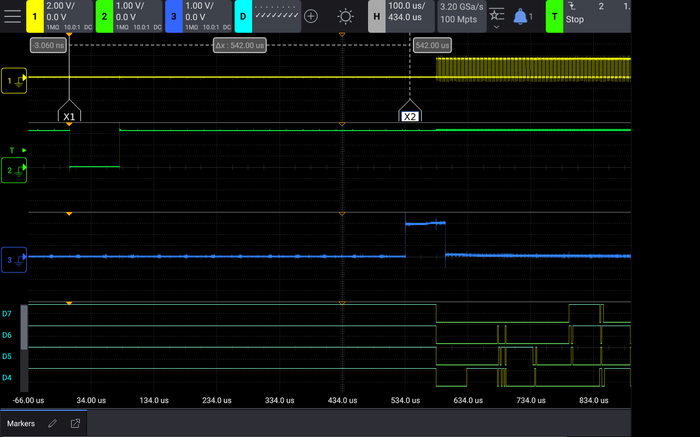
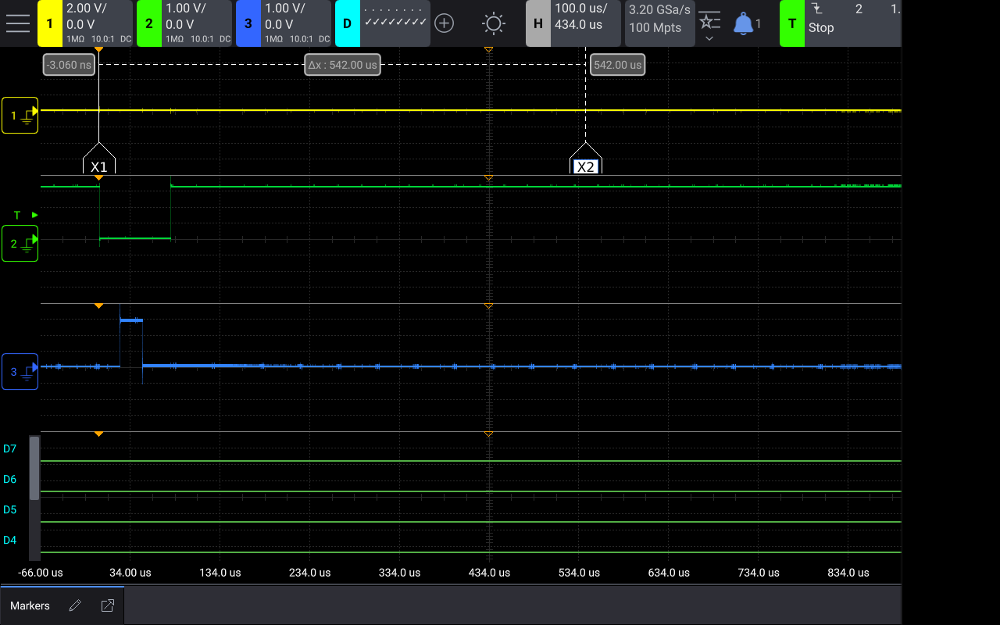

# Multi Segment Monitor

Instead of putting hundreds of 7 segment displays together (which is awesome),
take the short cut of using a VGA screen to simulate the displays.

An ASIC does the VGA signal generation, using the Tiny Tapeout standard.

The RP2350 on the demoboard interfaces with the ASIC to send data.

A 52 x 30 grid of digits — 1560 digits, 12480 segments — each segment with its own
4 bit brightness. The chip holds no framebuffer: it races the beam, keeping only the
digit row it is currently drawing. See [SPEC.md](SPEC.md) for the full design and the
reasoning behind it.

# Controls

* Data to display
* Levels of brightness — 4 bits per segment, gamma corrected
* Colour — set by a jumper on the output PMOD, not at runtime. Six output pins cannot
  carry both fine gradation and per-pixel colour, and every display this imitates is
  single colour anyway.

# Status

RTL complete: internal generator, byte-wide stream port, and a video pipeline that
turns any clip into segment intensities.

| | |
|---|---|
| VGA | 640x480 @ 72 Hz, 31.5 MHz |
| FPGA | 431 / 5280 logic cells (8%), 2 / 30 EBR |
| Timing | 39.14 MHz max, passes at 31.5 MHz |
| Tests | 4 cocotb + 3 converter, all passing, 3 frames against gold images |

**Working on the FPGA breakout.** The internal generator and the stream port both run
on hardware, driven from the demoboard — steps 1 and 2 of [Bring-up](#bring-up),
which is also where what that run cost is written down. Full rate video, step 3, has
not been run.

**The vsync tearing is fixed.** `firmware/seg_player.py` takes the vsync interrupt
with `hard=True`, which puts the DMA restart about 80 µs after the edge against a
budget of roughly 450 µs. Measured on a scope, not inferred — see
[If the picture tears](#if-the-picture-tears) for the captures and for why the
handler, not the restart code, was the slow part.

For the ASIC, the GDS builds, LVS matches and gate level simulation passes, but Tiny
Tapeout's precheck fails on 2672 KLayout DRC violations. All of them are inside the
IHP SRAM macro's own cells rather than in this design.

# Building

Needs [oss-cad-suite](https://github.com/YosysHQ/oss-cad-suite-build) on the path.

    make bitstream            # synth + place & route + pack, for the TT FPGA breakout
    make test                 # cocotb tests + converter tests
    make -C test delay-sweep  # vsync latency sweep, ~9 min, writes frame_delay_*.png
    make -C test gold         # rewrite the gold images after an intended change

`make bitstream` mirrors `tt_fpga.py harden` so it runs without the tt-support-tools
python environment. Deploying to the demoboard still needs the real tool:

    python tt_fpga.py --project-dir . configure --upload

or, equivalently:

    make flash TT_TOOLS=/path/to/tt-support-tools PORT=/dev/ttyACM4

`flash` rebuilds the bitstream if needed, then runs `tt_fpga.py configure --upload
--set-default --clockrate 31500000` against it. `PORT` defaults to `/dev/ttyACM4`.

The frame test captures from the output pins and writes `test/frame.png`, so geometry
can be iterated without hardware. That loop is what caught the first segment layout
filling its whole cell — adjacent digits merged into each other and the grid was
illegible.

Three captures are also compared pixel for pixel against committed images in
`test/gold/`, which is what catches a change in how the picture looks rather than a
violation of a rule — a segment a pixel wide, a gamma entry off by one. A mismatch
writes a `_diff.png` with the disagreeing pixels in red. After an intended change,
`make -C test gold` rewrites them; look at what it produces before committing, as
nothing else will.

# Bring-up

The order to try it in, chosen so each step adds one thing and a failure points
somewhere specific. Steps 1 and 2 have been through this on the FPGA breakout, and
the notes below are what that cost rather than what was expected to.

**On a new machine.** The build needs two paths:

    export PATH=/path/to/oss-cad-suite/bin:$PATH
    make bitstream TT_TOOLS=/path/to/tt-support-tools

`configure --upload` also needs tt-support-tools' python environment, which was
missing `klayout` and `chevron` on the machine this was written on —
`pip install -r requirements.txt` in that repo.

The prototype output is a **Digilent PmodVGA** across both output headers: R on
`uo_out[3:0]`, B on `uo_out[7:4]`, G on `uio[3:0]`, hsync on `uio[4]` and vsync on
`uio[5]`. The 6 bit intensity is truncated to 4 and replicated across all three
channels, so the picture is grey at 16 levels rather than the native 64. Strobe and
mode select sit on `uio[6]` and `uio[7]`, which is where PmodVGA leaves two pins not
connected.

**1. Internal generator, no firmware.** Leave `uio[7]` low and the design ignores the
stream port entirely. You should get a 52x30 grid of hex digits scrolling diagonally
with brightness bands across it. Compare against `test/gold/generator.png`, which is
the same thing from simulation.

If this fails, in rough order of likelihood:

| Symptom | Look at |
|---|---|
| Nothing at all, and the project never came up | `tt.shuttle.<name>.enable()` reads a dedicated GPIO to detect the FPGA carrier, and on this board that detect is unreliable — it falls back to the ASIC shuttle mux and the name lookup fails. `firmware/seg_player.py` pushes the bitstream with `spi_transferPIO` instead, which is all `.enable()` does for an FPGA target |
| No signal / monitor out of range | The clock. Ask `clock_project_PWM` what it actually produced rather than assuming a divider: it retunes the RP2350's own sysclk to whatever divides most cleanly to the target, so the ratio from sysclk to pixel clock is not fixed. Anything derived from the pixel clock has to be derived from the value it returns |
| Sync but no picture, or garbage | Pmod pinout. Only PmodVGA is wired up, and it needs both headers — hsync and vsync are on `uio[4:5]`, not on `uo_out` at all. Tiny VGA and the VGA Clock pmod both have a different order |
| Picture but sheared or rolling | VGA timing constants — but these come from `ttihp0p4-vga-clock`, which works, so suspect the clock first |

**2. Streamed static image.** Set `uio[7]` high and push a single frame repeatedly.
`tools/video2seg.py` on a still image gives you one, and `tools/make_diag_pattern.py`
gives you a frame built to make corruption countable rather than subtle — one segment
per row keyed on `row % 4`, so stale data from the wrong line buffer slot lights the
wrong segment instead of shifting a brightness. If the generator worked and this does
not, the problem is in the stream port or the player, not the renderer.

**3. Video.** Only after 2 is stable.

## If the picture tears

This is the failure the hardware run actually produced, and it is worth recognising
on sight because the cause is not where it appears to be.

Each digit row is drawn from a line buffer the host is still filling. The renderer
re-reads the whole 208 byte row on every one of its 16 scanlines — 832 clocks — while
the host takes 13312 to fill it, so the host has to be a **full row ahead**. It builds
that lead during vertical blanking, 819 µs, and anything spent before the first byte
comes straight off it.

`make -C test delay-sweep` puts numbers on it by delaying the testbench host's first
byte after vsync, 0 to 1000 µs, and writing a frame for each:

| Delay before first byte | Lead | Result |
|---|---|---|
| ≤ 400 µs | ≥ 206 bytes | clean |
| 500 µs | 157 bytes | tears from column 42 |
| 600 µs | 108 bytes | tears from column 29 |
| 800 µs | 9 bytes | tears from column 4 |

So the budget from vsync to the first byte is **about 450 µs**, and what blew it was
the *dispatch*, not the handler body.

`Pin.irq` defaults to a soft IRQ, which does not run in the interrupt at all — it
waits for `micropython.schedule()` to reach a bytecode boundary, and `service()`
reads 6240 bytes off flash in one uninterruptible call. That routinely pushed the
first strobe out to 500–600 µs. Passing `hard=True` dispatches from the interrupt
itself and brings it to about 80 µs, comfortably inside budget, with the ordinary
`dma.config()` body left alone.

Both captures below are the same trigger on vsync falling, with the cursor pair set
542 µs apart:

*Soft IRQ: nothing has moved by the 542 µs cursor, and the byte stream starts after
it.*

*`hard=True`: the handler runs at the left edge of the window instead.*

Rewriting the handler to poke the DMA registers directly was tried first and is not
the answer. The restart code was never the slow part, and the register version broke
the DMA trigger outright — no strobe and no data at all.

If it ever tears again, measure from vsync falling to the first strobe before
changing anything. Interrupt latency itself is under 10 µs on this platform, so it is
not a plausible cause on its own.

The signature, if you want to confirm the diagnosis rather than infer it: the tear
starts at column ≈ lead/4 + 2.5 and walks right as the row is drawn, so digits show
one frame in their top half and another in their bottom. The stale content is digit
row **R−4**, four buffers back — on a still image that reads as a piece of the picture
from elsewhere, not as a repeat.

# Playing video

    tools/video2seg.py clip.mp4 video.seg --fps 24    # 6240 bytes per frame
    tools/seg2png.py video.seg preview.png --frame 30 # check it before deploying

Each of the 12480 segments averages the source pixels its own rectangle covers, in
linear light — one sample per digit would throw away most of the resolution that
per-segment brightness exists to provide.

Copy the `.seg` file and `firmware/seg_player.py` to the demoboard. At 6240 bytes per
frame a 4 MB flash holds about 26 seconds at 24 fps.

The chip has no framebuffer, so the player re-pushes every displayed frame at 72.8 Hz
(454 kB/s) regardless of the video's own rate. Pacing is free: a digit row is 16
scanlines and 208 bytes, so one byte every 64 pixel clocks tracks the raster exactly,
with no remainder to accumulate.

# Inspiration

* https://hackaday.com/2020/03/05/144-7-segment-displays-combine-to-form-a-mighty-clock/
* https://hackaday.com/2025/05/24/ai-art-installation-swaps-diffusion-for-reflection/
* https://hackaday.com/2013/11/21/7-segment-display-matrix-visualizes-more-than-numbers/
* https://hackaday.com/2021/09/14/whats-cooler-than-a-7-segment-display-a-7200-segment-display/
* https://hackaday.com/2023/02/23/sailing-on-a-sea-of-seven-segment-displays/
* https://hackaday.com/2012/03/30/display-made-out-of-hundreds-of-seven-segment-lcds/
* Sea of Segments — 1536 digits, 5 bit grayscale, the closest real world comparable
  https://willga.llia.io/sea-of-segments/build/

# Resources

* Tiny Tapeout VGA standard https://vga-playground.com/
* Tiny Tapeout VGA Pmod https://tinytapeout.com/specs/pinouts/#vga-output
* Tiny Tapeout ETR demoboard https://tinytapeout.com/guides/get-started-demoboard-etr/
* Tiny Tapeout FPGA breakout https://tinytapeout.com/guides/fpga-breakout/
* Example RLE Video player: https://tinytapeout.com/chips/ttsky25a/tt_um_MichaelBell_rle_vga
